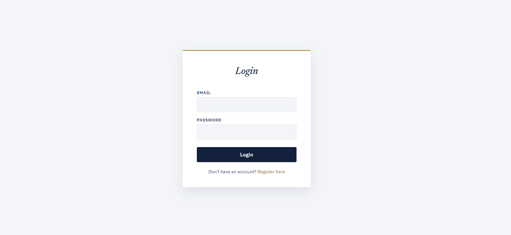
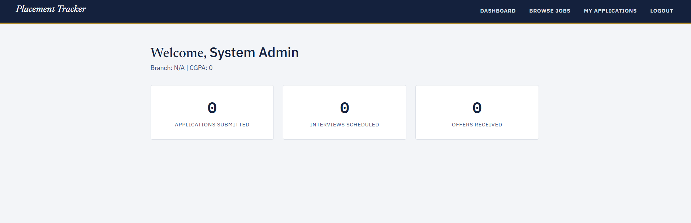
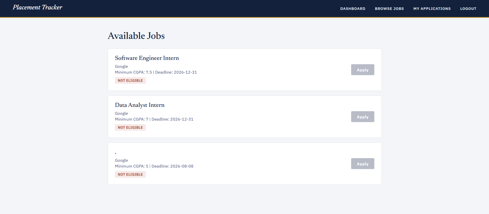
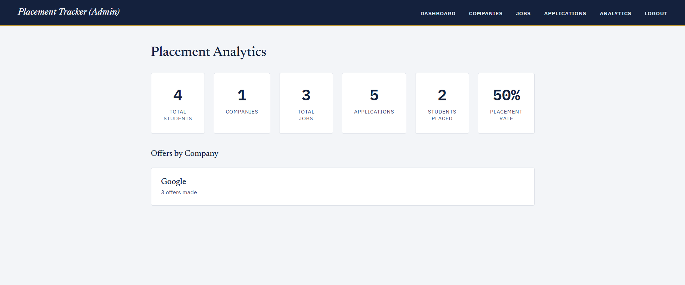

# Placement Tracker System

A full-stack college placement management system with role-based access control, built end-to-end with Java Spring Boot, MySQL, and vanilla HTML/CSS/JavaScript — from database design through a secured REST API to a working, tested browser UI.

## Status

✅ Core system complete: database, secured API, and full frontend for both Student and Admin roles, covering the entire placement workflow from registration through offer acceptance.

## Problem Statement

College placement processes are often managed through spreadsheets and email, leaving students without a single place to track their applications and leaving placement admins without a structured way to manage companies, jobs, applications, interviews, and offers. This system centralizes the entire process into one secure, role-based web application.

## Features

**Students can:**
- Register and log in securely
- Browse companies and jobs, with automatic eligibility checking (CGPA, deadline)
- Apply to eligible jobs
- Track their application status through the full pipeline
- View scheduled interviews
- View, accept, or decline job offers
- View and download a formatted offer letter

**Admins can:**
- Manage companies and jobs (full CRUD)
- Review and update application statuses through a validated workflow
- Schedule interviews
- Create offers
- View aggregate placement analytics (placement rate, offers per company, etc.)

## User Roles

| Role | Access |
|---|---|
| STUDENT | Own profile, jobs, own applications/interviews/offers only |
| ADMIN | Full management of companies, jobs, applications, interviews, offers, and analytics |

Enforced via JWT authentication and Spring Security role-based + resource-ownership authorization — never relying on frontend restrictions alone.

## Tech Stack

- **Frontend:** HTML, CSS, JavaScript (vanilla, no framework)
- **Backend:** Java, Spring Boot, Spring Data JPA, Spring Security
- **Database:** MySQL
- **Auth:** JWT (JSON Web Tokens), BCrypt password hashing
- **Tools:** IntelliJ IDEA, VS Code, MySQL Workbench, Postman, Git/GitHub

## Architecture

Client-server architecture with a layered Spring Boot backend:

```
Browser (HTML/CSS/JS)
        |
        v   HTTP + JWT
Controller layer
        |
        v
Service layer      (business rules, status workflow)
        |
        v
Repository layer   (Spring Data JPA)
        |
        v
MySQL Database
```

Full details: [Architecture](docs/architecture.md)

## Database Schema

7 tables (`users`, `students`, `companies`, `jobs`, `applications`, `interviews`, `offers`), fully normalized, with foreign keys, unique constraints, and an application status state machine enforced in code.

Full details: [Database Design](docs/database-design.md) | [ER Diagram](docs/er-diagram.md)

## Application Status Workflow

```
APPLIED → UNDER_REVIEW → SHORTLISTED → INTERVIEW_SCHEDULED → SELECTED → OFFERED
                ↓                ↓                ↓
            REJECTED         REJECTED          REJECTED
```

Enforced generically via a transition map in `ApplicationService`, not hardcoded per-status. Rejections from SHORTLISTED or later require a reason, visible to the affected student.

## API Overview

REST API under `/api`, covering auth, companies, jobs, applications, interviews, offers, students, and analytics. Every endpoint uses DTOs (never exposes entities directly), consistent JSON error responses, and role/ownership-based authorization.

Full endpoint-by-endpoint documentation: [Controllers Part 1](docs/controllers-part1.md) · [Part 2](docs/controllers-part2.md) · [Part 3](docs/controllers-part3.md) · [Part 4](docs/controllers-part4.md) · [Part 5](docs/controllers-part5.md) · [Part 6](docs/controllers-part6.md)

## Security

- Passwords hashed with BCrypt — verified directly in the database, never stored or logged in plaintext
- Stateless JWT authentication, validated on every request via a custom filter
- Role-based access control (`hasRole("ADMIN")`) on all write/admin operations
- Resource-ownership checks — a student cannot view or act on another student's data
- Centralized, consistent error handling with no internal detail leakage on unexpected errors

Full details: [Authentication Part 1](docs/auth-part1.md) · [Part 2](docs/auth-part2.md) · [Part 3](docs/auth-part3.md) · [Part 4](docs/auth-part4.md) · [Part 5](docs/auth-part5.md) · [Part 6](docs/auth-part6.md)

## Testing

- **Automated unit tests** (JUnit 5 + Mockito): 10 passing tests covering core business rules (duplicate applications, deadlines, eligibility, status transitions, rejection-reason requirements) — see [Testing Part 1](docs/testing-part1.md) · [Part 2](docs/testing-part2.md)
- **Extensive manual testing**: every endpoint and every business rule verified via Postman; every page and workflow verified end-to-end in the browser, including adversarial role/ownership tests (no token / wrong role / correct role)

## Screenshots

| Login | Student Dashboard |
|---|---|
|  |  |

| Jobs | Analytics |
|---|---|
|  |  |

## Project Structure

```
placement-tracker-system/
├── database/                     SQL schema
├── docs/                         Full phase-by-phase documentation
├── placement-tracker-backend/    Spring Boot application
│   └── src/main/java/.../
│       ├── entity/
│       ├── repository/
│       ├── service/
│       ├── controller/
│       ├── dto/
│       ├── config/                Security, JWT, CORS
│       └── exception/             Centralized error handling
├── placement-tracker-frontend/
│   ├── css/
│   ├── js/
│   └── *.html
└── README.md
```

## Setup & Installation

### Prerequisites
- Java 17+, Maven, MySQL 8+, a modern browser, VS Code with the Live Server extension (or any static file server)

### Backend
1. Create the database: run `database/schema.sql` in MySQL Workbench
2. In `placement-tracker-backend/src/main/resources/`, create `application-local.properties` (gitignored) with:
   ```properties
   spring.datasource.url=jdbc:mysql://localhost:3306/placement_tracker_db
   spring.datasource.username=root
   spring.datasource.password=YOUR_PASSWORD
   spring.datasource.driver-class-name=com.mysql.cj.jdbc.Driver
   ```
3. Run `PlacementTrackerBackendApplication.java` from IntelliJ (or `mvn spring-boot:run`)
4. Backend runs at `http://localhost:8080`

### Frontend
1. Open `placement-tracker-frontend/login.html` with VS Code's Live Server extension
2. Runs at `http://127.0.0.1:5500`

## Full Documentation Index

Every phase of this project — from requirements through deployment — is documented in `docs/`:

[Requirements](docs/requirements.md) · [Architecture](docs/architecture.md) · [Database Design](docs/database-design.md) · [ER Diagram](docs/er-diagram.md) · [Spring Boot Setup](docs/spring-boot-setup.md) · [Database Connection](docs/database-connection.md) · [Entities](docs/entities.md) · [Repositories](docs/repositories.md) · [Services Part 1](docs/services-part1.md) / [Part 2](docs/services-part2.md) · [Controllers Parts 1–6](docs/controllers-part1.md) · [Authentication Parts 1–6](docs/auth-part1.md) · [Frontend Parts 1–6](docs/frontend-part1.md) · [Frontend Integration](docs/frontend-integration.md) · [Testing Parts 1–2](docs/testing-part1.md) · [Analytics](docs/analytics.md)

## Future Enhancements

- Resume upload
- Email notifications
- Offer decline-reason capture (backend groundwork already in place)
- Deployment to a live hosting environment

## Author

Built as a guided, ground-up learning project — every layer (requirements, database design, backend, security, frontend, testing) implemented and understood individually, not scaffolded from a template.